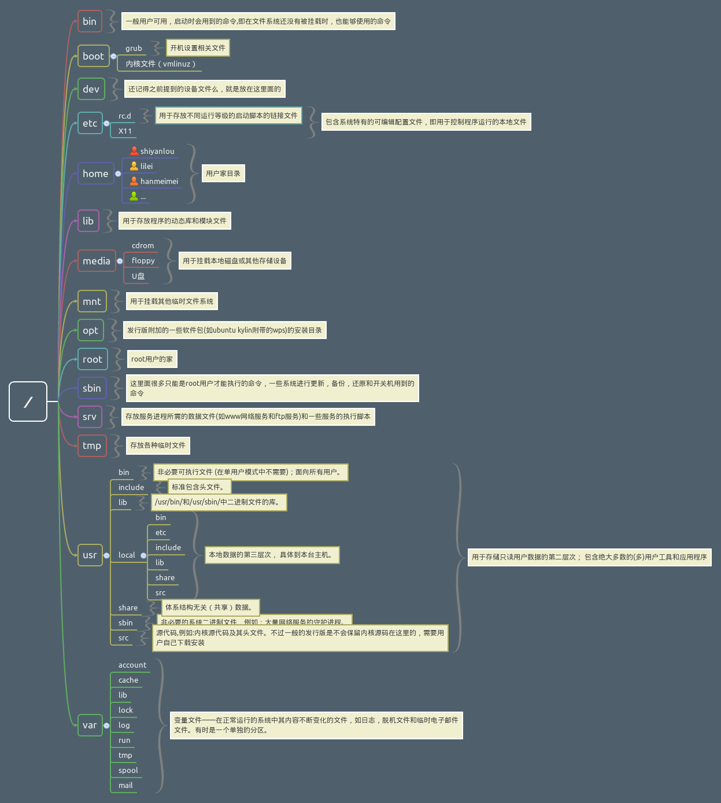

# 目录与文件

## 目录结构

### 路径

>  Linux 的目录是 树状结构，最顶级的目录为根目录 /。而其它目录可以通过挂载将它们添加到树中，通过解除挂载来移除。

- 进入用户主目录 cd ~

- 返回上一级 cd ..

- 获取当前路径 pwd

- 绝对路径
    - 绝对路径是从根目录 / 开始的完整路径

- 相对路径
    - 相对路径是以 . 或 .. 开始的，. 表示用户当前操作所处的目录，而 .. 表示上级目录。

### 文件树

- FHS 标准图

- FHS 标准定义了两层规范：

    - 第一层：/ 下面的各个目录应该放什么文件数据。例如 /etc 应放置配置文件，/bin 与 /sbin 则应该放置可执行文件等。

    - 第二层：针对 /usr 和 /var 这两个目录的子目录来定义。例如 /var/log 放置系统登录文件，/usr/share 放置共享数据等。

## Linux文件属性

- drwxr-xr-x   2   root    root    4.0K   9月  29  2019    bin

- 文件类型和权限、硬链接数、所有者、所属组、文件大小、最后修改时间、文件名

- 重要的概念就是Linux 里面一切皆文件。

### 文件类型

> 第一个字符代表的就是文件的类型，文件类型主要分为以下 7 种：

- 普通文件 -：文本文件、数据文件、可执行程序等等都可作为普通文件存储。

- 目录 d：目录中按照名字来对其它文件进行引用，用户通过 mkdir 创建目录，用 rmdir 来删除空目录，用 rm -r 来删除非空目录。

- 字符设备文件 c：字符设备文件让相关的驱动程序作为输入输出的缓冲。

- 块设备文件 b：块设备文件有处理块数据的 I/O 驱动程序使用，同时让内核提供缓冲。

- 本地域套接口 s：实现进程间通信的连接，本地域套接口由系统调用 socket 创建，用 rm 或 unlink 删除。

- 有名管道（FIFO）p：让运行在同一主机上的两个进程相互通信，和 socket 相似，用 mknod 创建，用 rm 来删除。

- 符号链接 l：也叫做 软链接，通过名字指向文件。用 ln -s 创建，用 rm 来删除。

### Linux文件权限

接下来的字符，以三个为一组，且均为 rwx 的三个参数组合，代表了 Linux 的 读、写、执行 三种权限控制。r 代表可读(read)、w 代表可写(write)、x 代表可执行(execute)。要注意的是，这三个权限的位置不会改变，如果没有权限，就会出现减号 -。
其中三位一组分别是所有者的权限(U,即 user)、所属组的权限(G,即 group)、其他用户的权限(O,即 other)。

- 权限

    | 数字 | 字符 | 文件/目录                               |
    | :--: | :--: | --------------------------------------- |
    |  4   |  r   | 查看文件内容/查看目录下的文件或目录名称 |
    |  2   |  w   | 修改文件内容/在目录下增删改             |
    |  1   |  x   | 执行一些程序或脚本/可以用命令切换目录   |

    | 八进制 | 二进制 | 权限 |
    | :----: | :----: | :--: |
    |   0    |  000   | ---  |
    |   1    |  001   | --x  |
    |   2    |  010   | -w-  |
    |   3    |  011   | -wx  |
    |   4    |  100   | r--  |
    |   5    |  101   | r-x  |
    |   6    |  110   | rw-  |
    |   7    |  111   | rwx  |

- `chmod` 改变文件或目录权限

    - `chmod [选项][权限][文件或目录]`

        - `--reference=RFILE`：根据参考文档设置权限。

        - `-R`：递归的将权限应用于所有的子目录和子文件。

        - 修改权限的 3 种形式

            > 首先通过 `ls -l` 命令来查看一下 `install.log` 文件，然后用 `chmod` 命令的三种不同形式来修改文件所有者权限、所属组权限和其他人权限。

            - 使用`字符形式`修改权限

                > 在 `chmod` 命令参数中，`u` 代表所有者，`g` 代表所属组，`o` 代表其他用户，`a` 代表所有人。修改 `install.log` 文件的权限设置成全部为可读、可写、可执行。

            - 使用`操作符形式`修改权限

                > 操作符形式是在字符形式的基础上对文件或目录使用 `+/-` 操作符来设置权限。通过 `+` 符号增加相应的权限，`-` 符号减去相应的权限。

            - 使用`数字形式`修改权限

    - `chown` 改变归属关系

        - chown 命令主要用于改变属主的所有权，语法和 chmod 类似。

    - `chgrp` 改变归属组

        - chgrp 命令是改变文件或目录所属组的所有权，语法和 chmod 类似。

    - `umask` 默认权限

        - `umask` 主要用来设置用户创建文件的默认权限，它与 `chmod` 的效果刚好相反。`umask` 设置的是权限“补码”，而 `chmod` 设置的是文件权限码。一般在 `/etc/profile`、`$[HOME]/.bash_profile` 或 `$[HOME]/.profile` 中设置 `umask` 值。

## Linux文件操作

### 查看文件

- `ls` 命令
- `cat`
- `tac`
- `more & less`
- `grep`
- `head & tail`

### 操作文件

- `touch`
- `mkdir`
- `cp`
- `rm`
- `mv`
- `du`
- `stat`

### 链接文件

- 创建方法

    - 软链接（符号链接）：`ln -s source target`
    - 硬链接（实体链接）：`ln source target`

- 软链接

    - 软链接文件又类似于 Windows 的快捷方式。它实际上是一个特殊的文件。在符号链接中，文件实际上是一个文本文件，其中包含有另一文件的位置信息。

- 硬链接

    - 软链接文件又类似于 Windows 的快捷方式。它实际上是一个特殊的文件。在符号链接中，文件实际上是一个文本文件，其中包含有另一文件的位置信息。

- 两种链接的区别

    - 硬链接文件有两个限制：

        1. 不允许给目录创建硬链接；
        2. 只有在同一文件系统中的文件之间才能创建链接，而且只有超级用户才有建立硬链接权限。

        软链接没有硬链接以上的两个限制，因而现在使用更为广泛，它具有更大的灵活性，甚至可以跨越不同机器、不同网络对文件进行链接。但是软链接的缺点在于：因为链接文件包含有原文件的路径信息，所以当原文件从一个目录下移到其它目录中，再访问链接文件，系统就找不到了；而硬链接就没有这个缺陷，你想怎么移就怎么移。还有它要系统分配额外的空间用于建立新的索引节点和保存原文件的路径。

        软链接可以跨分区，但源文件不能删除；硬链接不能跨分区，但可以删除源文件。

## 总结

> 通过本节实验我们掌握了 Linux 文件系统中包含的 Linux `目录结构`、`文件存储`、`文件类型和属性`、以及`常用的文件基本操作`。

